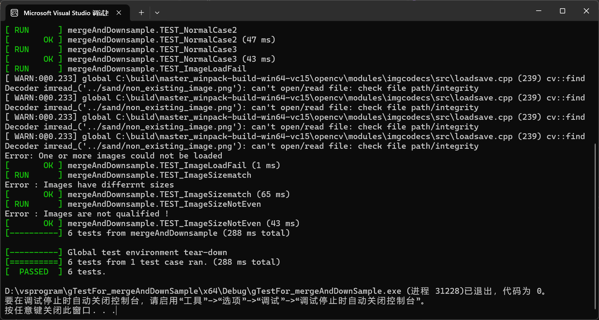
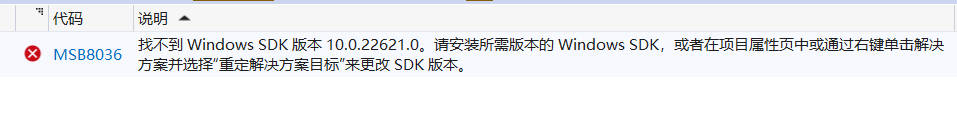

# mergeAndDownSample

#### 介绍
{**本demo为实现图片合并降采样**
基于opencv实现这一功能，点击解决方案sln文件，直接点击运行即可得到测试结果页面}

#### 环境配置

​	opencv 4.5.5 

#### 使用说明

1. 本库自动配置了opencv环境，空间大小可能较大

2. 使用的资源文件也均配置到了文件夹中，项目属性设置、代码中均使用文件的相对路径

3. 点击解决方案sln文件，直接点击运行即可得到测试结果页面

   

#### Note

​	如果运行出现SDK错误，如下图所示，则按照以下步骤操作：点击菜单栏 项目-> 重定目标解决方案->确定 ， 再运行即可。

​	

#### 测试

